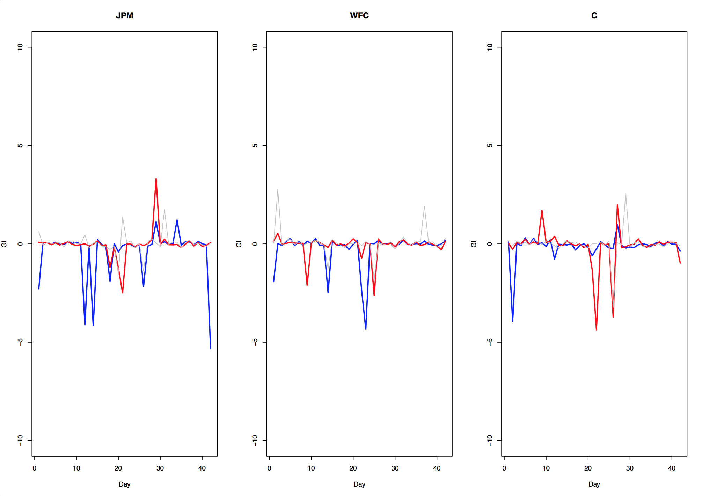
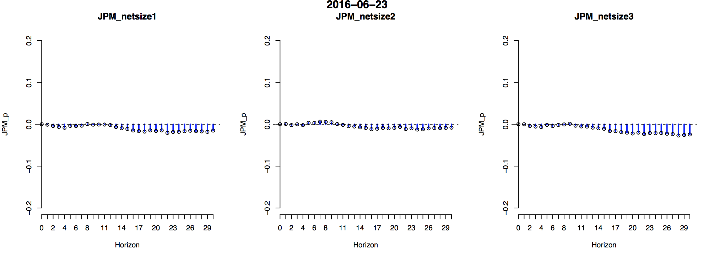
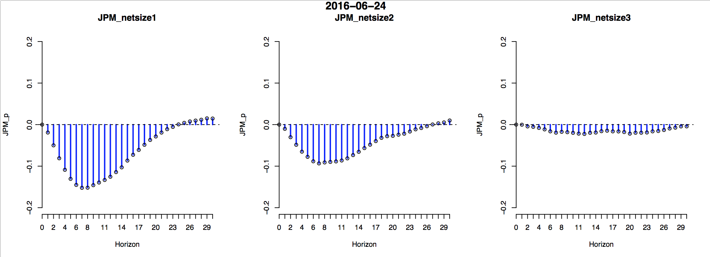
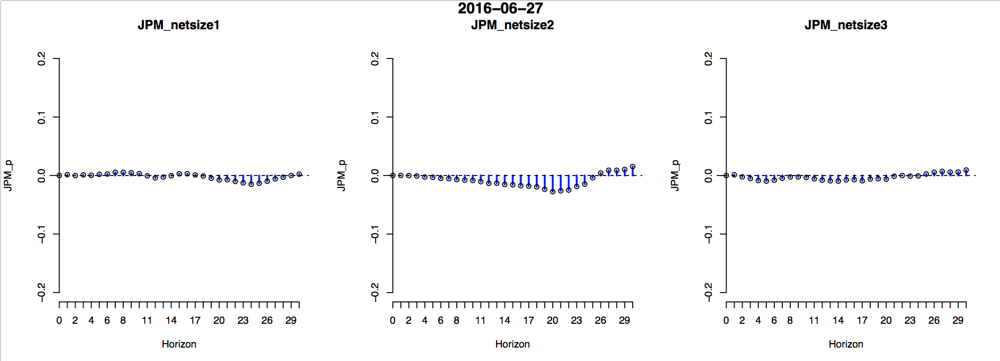

[](http://quantlet.de/)

## [](http://quantlet.de/) **hfhd_marketimpact_diff** [](http://quantlet.de/)

```yaml


Name of Quantlet: hfhd_marketimpact_diff

Published in: 	  Bootstrapped Market Impact with Limit Order Books

Description:      'hfhd_marketimpact_diff code plots the static and time-varying
		   net bootstrapped market impact with the estimated GIRF (30 
		   steps ahead forecasts).'


Keywords:         limit order book, market impact, bootstrapped, plot

Author:           Shi Chen

Submitted:        2017/09/11

Output:           'The net bootstrapped market impacts for the selected stocks.'

```









### R Code
```r

rm(list=ls(all=T))
graphics.off()
library(zoo)
load("mydate.RData")
load("GIR_diff_30s.RData")#ask-bid
coname= c("MSFT","T","IBM", "JNJ","PFE","MRK","JPM","WFC","C")
lobname = c("p", "netsize1","netsize2","netsize3")
na1 =rep(lobname, 9)
na2 = rep(coname, each=4)
myname2 = paste(na2, na1,sep="_")

myplot11 <- function(da, ny){
  day1=res1[[da]]
  m0 = 4*(ny-1) +1
  #par(mfrow=c(1,3))
  for(i in 1:3){
    m1= m0+i
    gi1 = day1[,-(1:3),m1]
    rownames(gi1)=myname2
    plot(gi1[m0,], type="h", col="blue",lwd=2, axes=F, xlab="Horizon",ylab = myname2[m0], main=myname2[m1], bg="transparent",ylim=c(-0.2,0.2))
    points(gi1[m0,])
    axis(1, 1:31, 0:30)
    axis(2, pos=1)
    abline(h=0, lty=2)
  }
  #mtext(mydate[ddd], side = 3, line = -1.3, outer = TRUE, font=2)
}

#the impact for netsize over time
ny=9
f1=n1=NULL
for(da in 1:length(res1)){
  day1=res1[[da]]
  m0 = 4*(ny-1) +1
  #par(mfrow=c(1,3))
  for(i in 1:3){
    m1= m0+i
    gi1 = day1[,-(1:3),m1]
    rownames(gi1)=myname2
    #n1=sum(gi1[m0,])
    n1=sum(gi1[m0,1:15])
    f1= c(f1,n1)
  }
  #myimp[[da]]=f1
}
myimp = matrix(f1, nr=3)# for given ny
rownames(myimp) = c("net_size1","net_size2","net_size3")

plot(myimp[1,], type="l", ylim = c(-10,10), col="blue", xlab="Day", ylab = "")
lines(myimp[2,], col="red")
lines(myimp[3,], col="grey")

#par(mfrow=c(3,3))
#for(ny in 1:9){
par(mfrow=c(1,3))
for(ny in 7:9){#for 3 financial stocks
#for(ny in 4:6){#for 3 technology
  f1=n1=NULL
  for(da in 1:length(res1)){
    day1=res1[[da]]
    m0 = 4*(ny-1) +1
    #par(mfrow=c(1,3))
    for(i in 1:3){
      m1= m0+i
      gi1 = day1[,-(1:3),m1]
      rownames(gi1)=myname2
      #n1=sum(gi1[m0,])
      n1=sum(gi1[m0,1:20])
      f1= c(f1,n1)
    }
    #myimp[[da]]=f1
  }
  myimp = matrix(f1, nr=3)# for given ny
  rownames(myimp) = c("net_size1","net_size2","net_size3")
  
  plot(myimp[1,], type="l", ylim = c(-8,8), col="blue", xlab="Day", ylab = "GI",lwd=2,main=coname[ny])
  lines(myimp[2,], col="red",lwd=2)
  lines(myimp[3,], col="grey",lwd=1)
}
#over the whole period
graphics.off()
for(da in 1:length(res1)){
  myplot11(da, 1)
  mtext(mydate[da], side = 3, line = -1.25, outer = TRUE, font=2)
}

###the effect of order imbalance
myplot11(29,1)

par(mfrow=c(3,3))
for(da in 17:19){
  myplot11(da, 7)
  mtext("2016.06.23 (Brexit) ~ 06.27", side = 3, line = -1.25, outer = TRUE, font=2)
}


```

automatically created on 2018-05-28