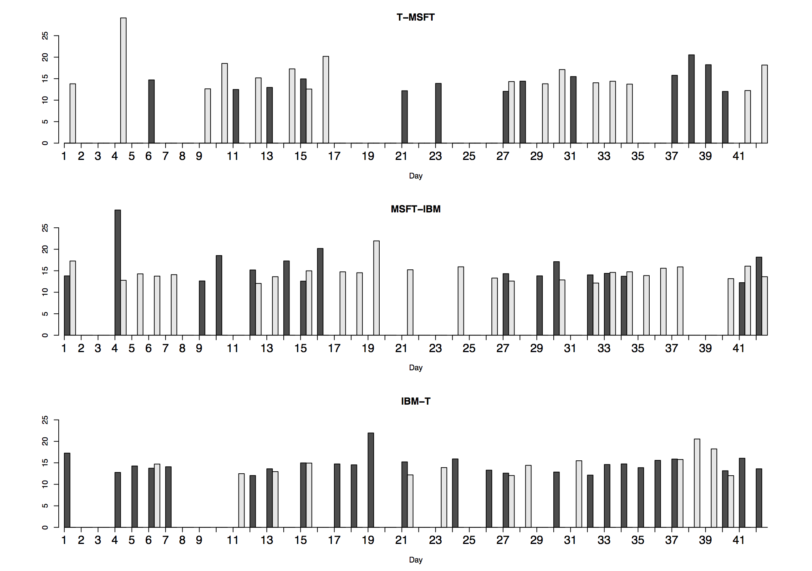
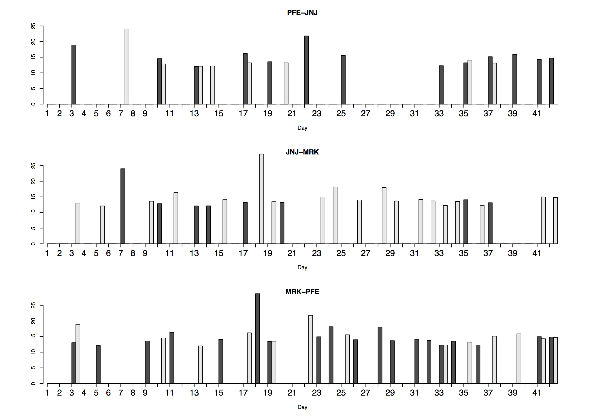
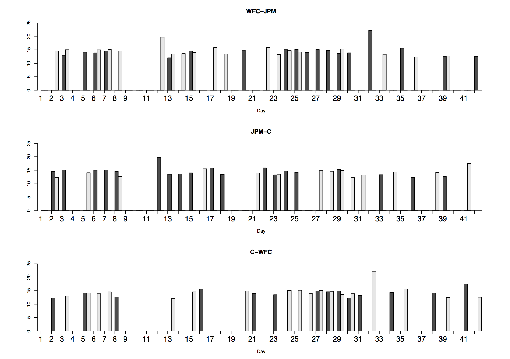

[](http://quantlet.de/)

## [](http://quantlet.de/) **hfhd_rob** [](http://quantlet.de/)

```yaml


Name of Quantlet: hfhd_rob

Published in: 	  Bootstrapped Market Impact with Limit Order Books

Description:      'hfhd_rob code plots the robust time-varying risk transmission channels 
		   within the selected industry sector.'


Keywords:         limit order book, market impact, bootstrapped, plot

Author:           Shi Chen

Submitted:        2017/09/11

Output:           'The bootstrapped estimates of robust risk channels for the selected 			   stocks.'

```







### R Code
```r

##section 5.2
rm(list=ls(all=T))
graphics.off()
library(zoo)
load("mydate.RData")
load("result3_IRG.RData")
#load("GIR_diff_30s.RData")#ask-bid
coname= c("MSFT","T","IBM", "JNJ","PFE","MRK","JPM","WFC","C")
lobname = c("p", "as1","bs1","as2","bs2","as3","bs3")
na1 =rep(lobname, 9)
na2 = rep(coname, each=7)
myname = paste(na2, na1,sep="_")

###
ny=c(1,2,3)
ny=c(4,5,6)
ny=c(7,8,9)
f1=n1=NULL
for(da in 1:length(res1)){
  day1=res1[[da]]
  m0 = 7*(c(ny[2],ny[1],ny[1],ny[3],ny[3],ny[2])-1)+1
  n0 = 7*(c(ny[1],ny[2],ny[3],ny[1],ny[2],ny[3])-1)+1
  #par(mfrow=c(3,2))
  for(i in 1:6){
    m1 = m0[i]
    m2 = n0[i]
    gi1 = day1[,-(1:3),m1]
    rownames(gi1)=myname
    n1=sum(abs(gi1[m0,1:20]))
    f1= c(f1,n1)
  }
}
myimp = matrix(f1, nr=6)# for given ny

myname1=coname[ny]
myname11=paste(c(myname1[2],myname1[1],myname1[1],
                 myname1[3],myname1[3],myname1[2]),
               c(myname1[1],myname1[2],myname1[3],
                 myname1[1],myname1[2],myname1[3]), sep="-" )
rownames(myimp)=myname11
rowSums(myimp)
myimp1=myimp
myimp1[which(myimp1<12)]=0
par(mfrow=c(3,1))
#barplot(myimp1[1:2,], beside = T, main = myname11[1], ylim = c(0,25),xlab = "Day", axes = F, col=c("blue","red"))
barplot(myimp1[1:2,], beside = T, main = myname11[1], ylim = c(0,25),xlab = "Day", axes = F)
axis(1,at=seq(1,125,by=3),labels=seq(1,42,by=1),cex.axis=1.5)
axis(2, pos=0)
barplot(myimp1[3:4,], beside = T, main = myname11[3], ylim = c(0,25),xlab = "Day", axes = F)
axis(1,at=seq(1,125,by=3),labels=seq(1,42,by=1),cex.axis=1.5)
axis(2, pos=0)
barplot(myimp1[5:6,], beside = T, main = myname11[5], ylim = c(0,25),xlab = "Day", axes = F)
axis(1,at=seq(1,125,by=3),labels=seq(1,42,by=1),cex.axis=1.5)
axis(2, pos=0)

```

automatically created on 2018-05-28